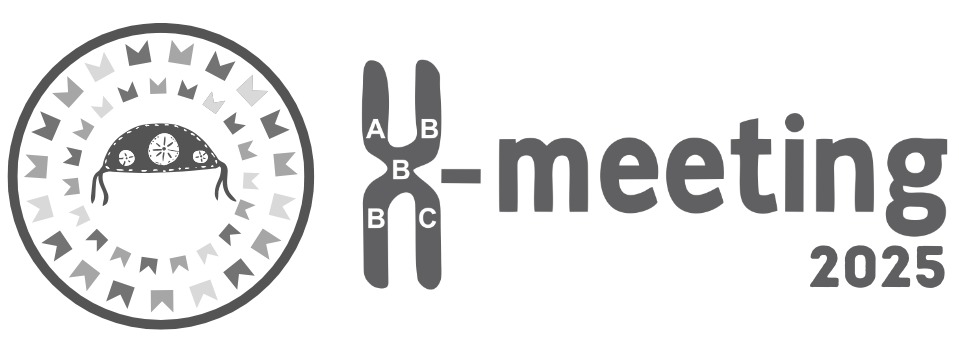

<h1 align="center">  </h1>      
<h1 align="center">  Introduction to BioPython - XMeeting 2025 </h1>     
     

## About this course

## Content
* Introduction to BioPython
* Accessing NCBI databases using Entrez
* Comapring sequences using BioBlast

## Team

| [ width=115> Angelina Meiras-Ottoni](https://github.com/AngelOttoni) |
| :---: |
| [ width=115> Juliana Félix](https://github.com/felix-juliana) |
| :---: |
| [ Natalia Coutouné](https://github.com/nat-coutoune) |
| :---: |

